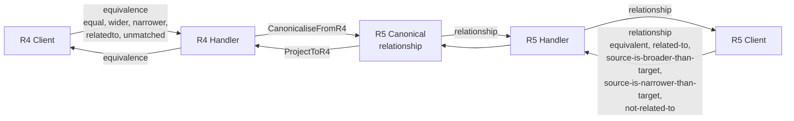

# fhir-map Developer Documentation

> A high-performance FHIR ConceptMap & StructureMap microservice for data engineers integrating medical terminology translation into ETL pipelines.

---

## Overview

**fhir-map** is a lightweight Go microservice implementing the FHIR ConceptMap resource (R4 + R5) with a non-standard `$translate-batch` operation optimized for bulk lookups. It is designed as a drop-in translation brick for ETL pipelines processing medical data — sub-millisecond single-code lookups, single-SQL-roundtrip batch translation, and 100k-row ingestion in under 2 seconds.

The server stores ConceptMap resources in PostgreSQL with a normalised `concept_map_mappings` table for the hot path and a JSONB `resource_json` column for audit/perfect round-trip.

---

## Architecture

```mermaid
graph TB
    Client[ETL Pipeline / FHIR Client]
    R4[/fhir/R4/...]
    R5[/fhir/R5/...]
    Alias[/fhir/... → R5 alias]

    Client --> R4
    Client --> R5
    Client --> Alias

    R4 --> R4Proj[R4 ↔ R5 Projection<br/>CanonicaliseFromR4 / ProjectToR4]
    R5 --> Handlers[ConceptMapHandler<br/>StructureMapHandler]

    R4Proj --> Handlers
    Handlers --> Service[conceptmap.Service]
    Service --> Repo[Repository Interface]

    Handlers --> FlatEngine[FlatEngine<br/>(translate + batch)]
    FlatEngine --> MappingStore[FlatStore<br/>(Postgres)]

    Repo --> PG[(PostgreSQL<br/>concept_maps +<br/>concept_map_mappings)]

    FlatEngine --> InlineFallback[JSONB Engine<br/>(inline ConceptMap only)]
```

### Key Architectural Decisions

| Decision | Choice | Rationale |
|----------|--------|-----------|
| R4/R5 dispatch | Parallel URL trees `/fhir/R4/...` and `/fhir/R5/...` | Explicit, testable, no content-negotiation guesswork |
| Canonical vocabulary | R5 `relationship` internally; R4 `equivalence` is wire-only | Single source of truth; lossless projection |
| Translate hot path | Flat `concept_map_mappings` table with compound indexes | Sub-ms lookups bounded by match count, not map size |
| Audit storage | Original JSONB on `concept_maps.resource_json` | Byte-perfect round-trip for reads |
| Bulk ingest | `pgx.CopyFrom` in create/update transaction | 100k mappings in ~1.5s |
| Optimistic concurrency | `If-Match: W/"N"` → 409 on stale writes | Matches HAPI behaviour; safe concurrent edits |

---

## Quick Start

### Prerequisites

- **Go** ≥ 1.25 (uses `slog`, generics, Go 1.22 `http.ServeMux` patterns)
- **Docker** (for PostgreSQL via `docker-compose` and `testcontainers-go` integration tests)
- **Make** (optional, for Makefile targets)

### Run the Server

```bash
# Start PostgreSQL
docker compose up -d postgres

# Build and run
make build && ./bin/fhir-map-server
# Or without Make:
go build -o /tmp/fhir-map-server ./cmd/server && /tmp/fhir-map-server
```

The server listens on **:8080** by default. Health check:

```bash
curl localhost:8080/health
# {"status":"healthy","timestamp":"2025-01-01T00:00:00Z"}
```

### Run Tests

```bash
# All tests (unit + integration with auto-provisioned Postgres container)
go test ./...

# Unit tests only (no Docker needed)
go test -short ./...

# Integration tests only
go test -run Integration ./...

# With coverage
go test -coverprofile=coverage.out ./... && go tool cover -html=coverage.out
```

### Docker Compose (Full Stack)

```bash
docker compose up -d    # Starts postgres + server
docker compose down -v   # Tear down and remove data
```

---

## Project Layout

```
cmd/server/                  # Entrypoint: main + golang-migrate wiring
internal/
  config/                    # Environment-driven configuration
  domain/
    conceptmap/              # Domain model, validator, R4↔R5 projection, service
    structuremap/             # StructureMap domain model (M5a: CRUD + search)
  handler/                   # HTTP handlers (one per FHIR version)
  repository/postgres/       # pgxpool-backed CRUD repo + FlatStore + migrations
  transform/                 # $transform engine (StructureMap, M5d+)
  translate/                 # translate.Engine (JSONB) + FlatEngine (production) + BatchTranslator
pkg/fhir/                    # Shared FHIR data types: Parameters, Bundle, Coding, etc.
docs/                        # 8 official FHIR ConceptMap example JSONs
bruno/                       # Bruno test collection (end-to-end)
testdata/                    # Test fixtures
```

### Key Source Files

| File | Purpose |
|------|---------|
| `cmd/server/main.go` | Server bootstrap, route wiring, graceful shutdown |
| `internal/config/config.go` | All env vars with sensible defaults |
| `internal/domain/conceptmap/model.go` | ConceptMap domain model + validation |
| `internal/domain/conceptmap/service.go` | Business logic: CRUD, search |
| `internal/domain/conceptmap/vocab.go` | Full R5↔R4 relationship↔equivalence matrix |
| `internal/domain/conceptmap/r4_projection.go` | `CanonicaliseFromR4` (ingress) + `ProjectToR4` (egress) |
| `internal/handler/conceptmap_handler.go` | HTTP handlers: CRUD, search, $translate, $translate-batch |
| `internal/translate/engine_flat.go` | Production translate engine (reads flat table) |
| `internal/translate/batch.go` | $translate-batch engine (single SQL roundtrip for N probes) |
| `internal/translate/store.go` | FlatStore / BatchFlatStore interfaces |
| `internal/repository/postgres/mapping_store.go` | Postgres FlatStore + BatchFlatStore implementation |
| `internal/repository/postgres/mappings_extract.go` | JSONB → flat rows extraction |
| `internal/repository/postgres/migrations/` | SQL migrations (4 files) |

---

## Configuration

All configuration is via environment variables with defaults:

| Variable | Default | Description |
|----------|---------|-------------|
| `SERVER_PORT` | `8080` | HTTP listen port |
| `SERVER_READ_TIMEOUT` | `30s` | Read timeout |
| `SERVER_WRITE_TIMEOUT` | `30s` | Write timeout |
| `SERVER_IDLE_TIMEOUT` | `120s` | Idle timeout |
| `SERVER_SHUTDOWN_TIMEOUT` | `15s` | Graceful shutdown deadline |
| `DB_HOST` | `localhost` | PostgreSQL host |
| `DB_PORT` | `5432` | PostgreSQL port |
| `DB_USER` | `fhir` | Database user |
| `DB_PASSWORD` | `fhir` | Database password |
| `DB_NAME` | `fhir` | Database name |
| `DB_SSL_MODE` | `disable` | SSL mode |
| `DB_MAX_CONNS` | `25` | Max connection pool size |
| `DB_MIN_CONNS` | `5` | Min connection pool size |
| `DB_MAX_CONN_LIFETIME` | `1h` | Max connection lifetime |
| `DB_MAX_CONN_IDLE_TIME` | `30m` | Max idle connection time |

---

## API Reference

### URL Trees

Three URL trees are mounted, all sharing the same storage and engine:

| Prefix | FHIR Version | Notes |
|--------|-------------|-------|
| `/fhir` | R5 | Backwards-compatible alias (pre-M2b Bruno suite) |
| `/fhir/R5` | R5 | Explicit R5 wire format |
| `/fhir/R4` | R4 | Accepts `equivalence`, emits `equivalence` |

### ConceptMap CRUD

```
POST   /fhir/{version}/ConceptMap               Create
GET    /fhir/{version}/ConceptMap/{id}            Read
PUT    /fhir/{version}/ConceptMap/{id}            Update (If-Match for optimistic concurrency)
DELETE /fhir/{version}/ConceptMap/{id}            Delete (soft)
GET    /fhir/{version}/ConceptMap                 Search
```

#### Create a ConceptMap

```bash
curl -X POST http://localhost:8080/fhir/R5/ConceptMap \
  -H "Content-Type: application/fhir+json" \
  -d '{
    "resourceType": "ConceptMap",
    "url": "http://example.org/cm-address-use",
    "name": "AddressUse",
    "status": "active",
    "group": [{
      "source": "http://hl7.org/fhir/address-use",
      "target": "http://hl7.org/fhir/v3/AddressUse",
      "element": [{
        "code": "home",
        "target": [{
          "code": "H",
          "relationship": "equivalent"
        }]
      }]
    }]
  }'
```

Response: `201 Created` with `Location` and `ETag` headers.

#### Read / Update / Delete

```bash
# Read
curl http://localhost:8080/fhir/R5/ConceptMap/{id}

# Update with optimistic concurrency
curl -X PUT http://localhost:8080/fhir/R5/ConceptMap/{id} \
  -H "If-Match: W/\"1\"" \
  -H "Content-Type: application/fhir+json" \
  -d @updated-map.json

# Delete (soft delete)
curl -X DELETE http://localhost:8080/fhir/R5/ConceptMap/{id}
```

#### Search Parameters

| Parameter | Type | Description |
|-----------|------|-------------|
| `_id` | token | Resource ID |
| `url` | uri | Canonical URL |
| `version` | token | Version |
| `name` | string | Name (case-insensitive) |
| `title` | string | Title |
| `status` | token | draft, active, retired, unknown |
| `publisher` | string | Publisher |
| `description` | string | Description |
| `date` | date | Date |
| `source-code` | token | Source code |
| `target-code` | token | Target code |
| `source-group-system` | uri | Source system of a group |
| `target-group-system` | uri | Target system of a group |
| `source-scope` | canonical | Source scope |
| `target-scope` | canonical | Target scope |
| `_count` | integer | Results per page (default 20, max 1000) |
| `_offset` | integer | Pagination offset |

### `$translate` Operation

Translates a concept from a source code system to a target code system using a ConceptMap.

```
GET  /fhir/{version}/ConceptMap/$translate
POST /fhir/{version}/ConceptMap/$translate
GET  /fhir/{version}/ConceptMap/{id}/$translate      (instance-level)
POST /fhir/{version}/ConceptMap/{id}/$translate       (instance-level)
```

#### Parameters (R5 names listed first; R4 aliases in parentheses)

| R5 Name | R4 Alias | Cardinality | Type | Description |
|---------|-----------|-------------|------|-------------|
| `url` | `url` | 0..1 | uri | Canonical URL of the ConceptMap |
| `conceptMapVersion` | `conceptMapVersion` | 0..1 | string | Version (or use pipe-delimited URL: `url\|version`) |
| `sourceCode` | `code` | 0..1 | code | Source code to translate |
| `sourceSystem` | `system` | 0..1 | uri | Source code system |
| `sourceCoding` | `coding` | 0..1 | Coding | Source coding (system\|code) |
| `sourceCodeableConcept` | `codeableConcept` | 0..1 | CodeableConcept | Multi-coding input (translates ALL codings) |
| `sourceScope` | `source` | 0..1 | uri | Source value set scope |
| `targetScope` | `target` | 0..1 | uri | Target value set scope |
| `targetSystem` | `targetsystem` | 0..1 | uri | Target system filter |
| `targetCode` | — | 0..1 | code | Reverse: target code to find source for |
| `targetCoding` | — | 0..1 | Coding | Reverse: target coding |
| `targetCodeableConcept` | — | 0..1 | CodeableConcept | Reverse: target CodeableConcept |
| `reverse` | — | 0..1 | boolean | Set `true` for reverse翻译 (R5) or use target* params |
| `dependency` | — | 0..* | complex | Dependency constraints |

> **Mutual Exclusion**: R4 and R5 spellings of the same parameter (`code`+`sourceCode`, `system`+`sourceSystem`, etc.) cannot be used together — the server returns `400 OperationOutcome`.

#### Example: Forward Translation (GET)

```bash
curl "http://localhost:8080/fhir/R5/ConceptMap/\$translate?\
url=http://example.org/cm-address-use&\
sourceSystem=http://hl7.org/fhir/address-use&\
sourceCode=home&\
targetSystem=http://hl7.org/fhir/v3/AddressUse"
```

#### Example: Forward Translation (POST)

```bash
curl -X POST http://localhost:8080/fhir/R5/ConceptMap/\$translate \
  -H "Content-Type: application/fhir+json" \
  -d '{
    "resourceType": "Parameters",
    "parameter": [
      {"name": "url", "valueUri": "http://example.org/cm-address-use"},
      {"name": "sourceSystem", "valueUri": "http://hl7.org/fhir/address-use"},
      {"name": "sourceCode", "valueCode": "home"},
      {"name": "targetSystem", "valueUri": "http://hl7.org/fhir/v3/AddressUse"}
    ]
  }'
```

#### Response Shape

```json
{
  "resourceType": "Parameters",
  "parameter": [
    {"name": "result", "valueBoolean": true},
    {"name": "match", "part": [
      {"name": "relationship", "valueCode": "equivalent"},
      {"name": "concept", "valueCoding": {"system": "http://hl7.org/fhir/v3/AddressUse", "code": "H"}},
      {"name": "originMap", "valueUri": "http://example.org/cm-address-use"}
    ]}
  ]
}
```

- On R4 tree: `relationship` → `equivalence` with R4 codes (`equivalent`, `wider`, `narrower`, `relatedto`, `unmatched`)
- On R5 tree: `relationship` with R5 codes (`equivalent`, `source-is-broader-than-target`, `source-is-narrower-than-target`, `related-to`, `not-related-to`)

#### Reverse Translation

Set `reverse=true` or provide `targetCode`/`targetCoding`/`targetCodeableConcept` parameters. The engine flips directionality automatically.

#### Unmapped Strategies

When a source code has no direct mapping, the ConceptMap's `group.unmapped` strategy applies:

| Mode | Behaviour |
|------|-----------|
| `fixed` | Returns the fixed code/display from the unmapped definition |
| `use-source-code` | Passes the input code through to the target system |
| `other-map` | Recursively translates using the referenced ConceptMap (depth cap: 5) |

#### Dependencies

The `dependency` input parameter constrains which targets are eligible by matching `dependsOn` on matching targets:

```json
{
  "name": "dependency",
  "part": [
    {"name": "attribute", "valueUri": "http://example.org/dep-attr"},
    {"name": "value", "valueCode": "some-value"}
  ]
}
```

### `$translate-batch` Operation (Non-Standard)

A bulk translation variant that takes N probes and resolves them in a **single SQL roundtrip** using `UNNEST WITH ORDINALITY`. Responses come back in input order.

```
POST /fhir/{version}/ConceptMap/$translate-batch
```

#### Request Parameters

| Name | Cardinality | Type | Description |
|------|-------------|------|-------------|
| `url` | 1..1 | uri | Canonical URL of the ConceptMap |
| `conceptMapVersion` | 0..1 | string | Version |
| `conceptMapId` | 0..1 | string | Logical ID (alternative to `url`) |
| `targetSystem` | 0..1 | uri | Global target system filter |
| `code` | 1..* | complex | One per probe, each with `part` containing `code` and `system` |

#### Example

```bash
curl -X POST http://localhost:8080/fhir/R5/ConceptMap/\$translate-batch \
  -H "Content-Type: application/fhir+json" \
  -d '{
    "resourceType": "Parameters",
    "parameter": [
      {"name": "url", "valueUri": "http://example.org/cm"},
      {"name": "code", "part": [
        {"name": "code", "valueCode": "home"},
        {"name": "system", "valueUri": "http://hl7.org/fhir/address-use"}
      ]},
      {"name": "code", "part": [
        {"name": "code", "valueCode": "work"},
        {"name": "system", "valueUri": "http://hl7.org/fhir/address-use"}
      ]}
    ]
  }'
```

#### Response Shape

```json
{
  "resourceType": "Parameters",
  "parameter": [
    {"name": "result", "valueBoolean": true},
    {"name": "translate", "part": [
      {"name": "input", "part": [
        {"name": "code", "valueCode": "home"},
        {"name": "system", "valueUri": "http://hl7.org/fhir/address-use"}
      ]},
      {"name": "result", "valueBoolean": true},
      {"name": "match", "part": [...]}
    ]},
    {"name": "translate", "part": [
      {"name": "input", "part": [
        {"name": "code", "valueCode": "work"},
        {"name": "system", "valueUri": "http://hl7.org/fhir/address-use"}
      ]},
      {"name": "result", "valueBoolean": true},
      {"name": "match", "part": [...]}
    ]}
  ]
}
```

#### Per-Probe Error Handling

Each probe is independent: if one mapping doesn't exist, that probe returns `result: false` with a message, while others succeed. `overall.result` is `true` if **any** probe matched.

### StructureMap CRUD (M5a)

```
POST   /fhir/{version}/StructureMap                  Create
GET    /fhir/{version}/StructureMap/{id}              Read
PUT    /fhir/{version}/StructureMap/{id}              Update (If-Match)
DELETE /fhir/{version}/StructureMap/{id}              Delete (soft)
GET    /fhir/{version}/StructureMap                   Search
```

### `$transform` Operation (M5d+)

```
POST /fhir/{version}/StructureMap/$transform
POST /fhir/{version}/StructureMap/{id}/$transform
```

> **Note**: `$transform` requires the StructureMap to include FML content. When the transform engine encounters a `translate` operation, it delegates to the ConceptMap `$translate` hot path.

#### Type Matching in `$transform`

The engine validates a StructureMap group input `Type` against the runtime `resourceType` of the supplied content. Three forms are supported:

| Form | Example | How it resolves |
|------|---------|-----------------|
| Short FHIR type name | `Patient` | Compared directly — no resolver call |
| HL7 canonical URL | `http://hl7.org/fhir/StructureDefinition/Patient` | Resolved via bundled HL7 R5 fixture (no DB hit) |
| Profile canonical URL | `http://my-hospital.org/fhir/StructureDefinition/MyPatientProfile` | Resolved by walking `baseDefinition` chain in the StructureDefinition registry |

**Resolver behaviour:**
- Base types (all 59 FHIR R5 primitives, abstract types, and common resources) are resolved from a bundled in-memory fixture — no database lookup and no operator action required.
- Custom profiles are resolved by walking the `baseDefinition` chain stored in the StructureDefinition registry (see CRUD endpoints below). The chain is traversed up to **8 hops**; cycle detection prevents infinite loops.
- Resolved URLs are cached for the lifetime of the process; the first resolution for a given URL hits the DB (once), all subsequent calls are served from the cache.
- If a URL cannot be resolved (unknown profile, chain exceeds 8 hops, or cycle detected), `$transform` returns **422** with `ErrInputTypeMismatch` and a diagnostic pointing to the `POST /fhir/R5/StructureDefinition` endpoint.

**Registering custom profiles:**

```bash
# Register a profile so the resolver can walk its baseDefinition chain
curl -X POST http://localhost:8080/fhir/R5/StructureDefinition \
  -H "Content-Type: application/fhir+json" \
  -d @my-patient-profile.json
```

After registration, a StructureMap whose group input `Type` is the profile canonical URL will resolve successfully.

### StructureDefinition CRUD (Story 2.4)

```
POST   /fhir/{version}/StructureDefinition                  Create
GET    /fhir/{version}/StructureDefinition/{id}             Read
PUT    /fhir/{version}/StructureDefinition/{id}             Update (If-Match)
DELETE /fhir/{version}/StructureDefinition/{id}             Delete (soft)
GET    /fhir/{version}/StructureDefinition                  Search
GET    /fhir/{version}/StructureDefinition/{id}/_history    Version history
GET    /fhir/{version}/StructureDefinition/{id}/_history/{vid} Specific version (vread)
```

Search parameters: `_id`, `url`, `version`, `name`, `status`, `kind`, `type`.

### Metadata & History

```
GET /fhir/{version}/metadata                                    CapabilityStatement
GET /fhir/{version}/ConceptMap/{id}/_history                    Version history
GET /fhir/{version}/ConceptMap/{id}/_history/{vid}              Specific version (vread)
GET /fhir/{version}/StructureMap/{id}/_history                  Version history
GET /fhir/{version}/StructureMap/{id}/_history/{vid}            Specific version (vread)
GET /fhir/{version}/StructureDefinition/{id}/_history           Version history
GET /fhir/{version}/StructureDefinition/{id}/_history/{vid}     Specific version (vread)
```

---

## Database Schema

### `concept_maps` (JSONB + metadata)

| Column | Type | Description |
|--------|------|-------------|
| `id` | TEXT PK | Logical resource ID (UUID) |
| `url` | TEXT | Canonical URL |
| `version` | TEXT | Version string |
| `name` | TEXT | Name |
| `title` | TEXT | Title |
| `status` | TEXT | draft, active, retired, unknown |
| `publisher` | TEXT | Publisher |
| `description` | TEXT | Description |
| `date` | TEXT | Date |
| `source_scope_*` | TEXT | Source scope URIs |
| `target_scope_*` | TEXT | Target scope URIs |
| `source_codes` | TEXT[] | GIN-indexed source codes |
| `target_codes` | TEXT[] | GIN-indexed target codes |
| `source_systems` | TEXT[] | GIN-indexed source systems |
| `target_systems` | TEXT[] | GIN-indexed target systems |
| `resource_json` | JSONB | Complete FHIR resource (audit-perfect round-trip) |
| `version_id` | INTEGER | Optimistic concurrency version |
| `pk` | BIGSERIAL | Internal numeric PK (foreign key target) |
| `created_at` | TIMESTAMPTZ | Creation time |
| `updated_at` | TIMESTAMPTZ | Last update time |
| `deleted_at` | TIMESTAMPTZ | Soft delete timestamp (NULL = active) |

### `concept_map_mappings` (Normalised hot-path table)

| Column | Type | Description |
|--------|------|-------------|
| `pk` | BIGSERIAL PK | Row ID |
| `concept_map_pk` | BIGINT FK → concept_maps.pk | Parent map |
| `group_index` | INT | Group position in the ConceptMap |
| `element_index` | INT | Element position in group |
| `target_index` | INT | Target position in element |
| `source_system` | TEXT NOT NULL | Source code system |
| `source_version` | TEXT | Source version |
| `source_code` | TEXT NOT NULL | Source code value |
| `source_display` | TEXT | Source display |
| `target_system` | TEXT | Target code system |
| `target_version` | TEXT | Target version |
| `target_code` | TEXT | Target code value |
| `target_display` | TEXT | Target display |
| `relationship` | TEXT NOT NULL | R5 relationship code |
| `equivalence` | TEXT NOT NULL | R4 equivalence code (stored for indexing) |
| `no_map` | BOOLEAN | Element has noMap |
| `comment` | TEXT | Comment |
| `depends_on_jsonb` | JSONB | Serialized dependsOn entries |
| `product_jsonb` | JSONB | Serialized product entries |
| `property_jsonb` | JSONB | Serialized property entries |

**Key indexes**:
- `idx_cmm_forward` on `(source_system, source_code, concept_map_pk)` — forward $translate
- `idx_cmm_reverse` on `(target_system, target_code, concept_map_pk)` — reverse $translate
- `idx_cmm_by_map_order` on `(concept_map_pk, group_index, element_index, target_index)` — ordered scans

### `concept_map_unmapped` (Per-group unmapped strategy)

| Column | Type | Description |
|--------|------|-------------|
| `concept_map_pk` | BIGINT FK → concept_maps.pk | Parent map |
| `group_index` | INT | Group position |
| `group_source` | TEXT | Source system of the group |
| `group_target` | TEXT | Target system of the group |
| `mode` | TEXT NOT NULL | One of: fixed, use-source-code, other-map |
| `code`, `display`, `relationship` | TEXT | Fixed-mode output values |
| `other_map` | TEXT | Referenced ConceptMap URL (other-map mode) |

---

## Validation

### Strict Mode (default)

All HTTP create/update operations use strict validation by default. This enforces:
- Required `resourceType` = "ConceptMap"
- Required `status` (one of: draft, active, retired, unknown)
- Required `group[].element[]` (non-empty)
- Each element must have `code` or `valueSet` (but not both)
- Each target must have `relationship` (R5 vocabulary enforced)
- `unmapped.mode` must be one of: fixed, use-source-code, other-map

### Lenient Mode

Append `?_validate=lenient` to create/update requests. This skips vocabulary checks (status values, relationship codes, unmapped.mode values) so that spec-incomplete FHIR fixtures can be loaded:

```bash
curl -X POST "http://localhost:8080/fhir/R5/ConceptMap?_validate=lenient" \
  -H "Content-Type: application/fhir+json" \
  -d @conceptmap-example-2.json
```

---

## R4 ↔ R5 Vocabulary Projection



- **Ingress (`CanonicaliseFromR4`)**: R4 `equivalence` codes are lifted to R5 `relationship` before storage. R4-only codes (`equal`, `subsumes`, `specializes`, `inexact`, `disjoint`) map to their closest R5 equivalent; some mappings are lossy.
- **Egress (`ProjectToR4`)**: R5 `relationship` codes are projected back to R4 `equivalence` for responses on the `/fhir/R4` tree.
- **Mutual exclusion**: Passing both R4 and R5 spellings in the same request returns `400 OperationOutcome`.

Full mapping table:

| R5 Relationship | R4 Equivalence | Lossy? |
|-----------------|---------------|--------|
| `equivalent` | `equivalent` | No |
| `related-to` | `relatedto` | No |
| `source-is-broader-than-target` | `wider` | No |
| `source-is-narrower-than-target` | `narrower` | No |
| `not-related-to` | `unmatched` | No |
| ← R4 `equal` | → `equivalent` | Yes |
| ← R4 `subsumes` | → `source-is-broader-than-target` | Yes |
| ← R4 `specializes` | → `source-is-narrower-than-target` | Yes |
| ← R4 `inexact` | → `related-to` | Yes |
| ← R4 `disjoint` | → `not-related-to` | Yes |

---

## ETL Integration Guide

### Bulk Loading ConceptMaps

For ETL pipelines that need to load large ConceptMaps, the server normalises them into the flat `concept_map_mappings` table during create/update. Use `pgx.CopyFrom`-path ingestion (the server does this automatically on every create/update):

```bash
# Create a ConceptMap with 100k+ mappings in ~1.5s
curl -X POST http://localhost:8080/fhir/R5/ConceptMap \
  -H "Content-Type: application/fhir+json" \
  -d @large-conceptmap.json
```

### Batch Translation in ETL Pipelines

The `$translate-batch` operation is the primary integration point for ETL. It accepts N code lookups in a single HTTP request and resolves them in a **single SQL roundtrip**:

```python
import requests

# Example: batch translate 3 codes in one request
response = requests.post(
    "http://localhost:8080/fhir/R5/ConceptMap/$translate-batch",
    json={
        "resourceType": "Parameters",
        "parameter": [
            {"name": "url", "valueUri": "http://example.org/cm-icd10-to-snomed"},
            {"name": "code", "part": [
                {"name": "code", "valueCode": "A00"},
                {"name": "system", "valueUri": "http://hl7.org/fhir/sid/icd-10"}
            ]},
            {"name": "code", "part": [
                {"name": "code", "valueCode": "A01"},
                {"name": "system", "valueUri": "http://hl7.org/fhir/sid/icd-10"}
            ]},
            {"name": "code", "part": [
                {"name": "code", "valueCode": "B20"},
                {"name": "system", "valueUri": "http://hl7.org/fhir/sid/icd-10"}
            ]}
        ]
    }
)
result = response.json()
# result.parameter[0] = overall boolean
# result.parameter[1..N] = per-probe results with input echo
```

### Performance Characteristics (Single Machine, Warm Cache)

| Metric | Value |
|--------|-------|
| Single `$translate` p50 | 2 ms |
| Single `$translate` p99 | 5 ms |
| 100k mapping ingest | ~1.5 s |
| Bruno collection (25 requests, 106 assertions) | All passing |

### Single-Code Lookup

For lower-volume or real-time translation needs:

```bash
# Type-level (by canonical URL)
curl "http://localhost:8080/fhir/R5/ConceptMap/\$translate?\
url=http://example.org/cm&\
sourceSystem=http://source.system&\
sourceCode=A00&\
targetSystem=http://target.system"

# Instance-level (by resource ID)
curl "http://localhost:8080/fhir/R5/ConceptMap/{id}/\$translate?\
sourceCode=A00&\
system=http://source.system"
```

### Optimistic Concurrency for Safe Concurrent Updates

```bash
# Step 1: Read the resource (note the ETag)
curl -I http://localhost:8080/fhir/R5/ConceptMap/{id}
# → ETag: W/"3"

# Step 2: Update with If-Match
curl -X PUT http://localhost:8080/fhir/R5/ConceptMap/{id} \
  -H "If-Match: W/\"3\"" \
  -H "Content-Type: application/fhir+json" \
  -d @updated-map.json
# → 200 OK with new ETag: W/"4"
# → 409 Conflict if someone else updated first
```

---

## Testing

### Unit Tests

```bash
go test -short ./...
```

### Integration Tests (requires Docker)

Integration tests auto-provision a PostgreSQL container:

```bash
go test ./...
```

### Bruno Collection (End-to-End)

```bash
cd bruno
npx --yes @usebruno/cli@latest run --env local
```

Expected: **25 requests, 106 assertions, all passing.**

### Benchmark

```bash
go test -bench=. -benchmem ./...
```

---

## Error Responses

All errors follow the FHIR OperationOutcome format:

```json
{
  "resourceType": "OperationOutcome",
  "issue": [{
    "severity": "error",
    "code": "not-found",
    "diagnostics": "Resource not found"
  }]
}
```

| HTTP Status | Code | When |
|-------------|------|------|
| 400 | `invalid` | Invalid JSON, validation errors, R4/R5 parameter conflicts |
| 404 | `not-found` | Resource not found, ConceptMap URL not found |
| 409 | `conflict` | Optimistic concurrency failure (stale `If-Match`) |
| 500 | `exception` | Unexpected internal error (no PHI or details leaked) |

---

## Roadmap

| Milestone | Status | Description |
|-----------|--------|-------------|
| M1 | Complete | ConceptMap CRUD, search, `$translate` with all features |
| M2a | Complete | Canonical R5 model + R4 wire adapter + parallel URL trees |
| M2b | Complete | Parallel `/fhir/R4` and `/fhir/R5` URL trees |
| M3a-c | Complete | Flat-table translate engine + shadow-diff oracle + promotion |
| M3.5 | Complete | `$translate-batch` single-SQL-roundtrip bulk operation |
| M4.1 | Complete | CapabilityStatement at `/{prefix}/metadata` |
| M4.2 | Complete | `_history` and `vread` |
| M4.3 | Complete | Two-tier validator (strict + lenient) |
| M5a | Complete | StructureMap CRUD + search + `_history` + `vread` |
| M5d | Complete | `$transform` engine wired (FML parser + FHIRPath subset + transform executor) |
| M5f | Complete | Full `$transform` with `translate` delegation to ConceptMap hot path |